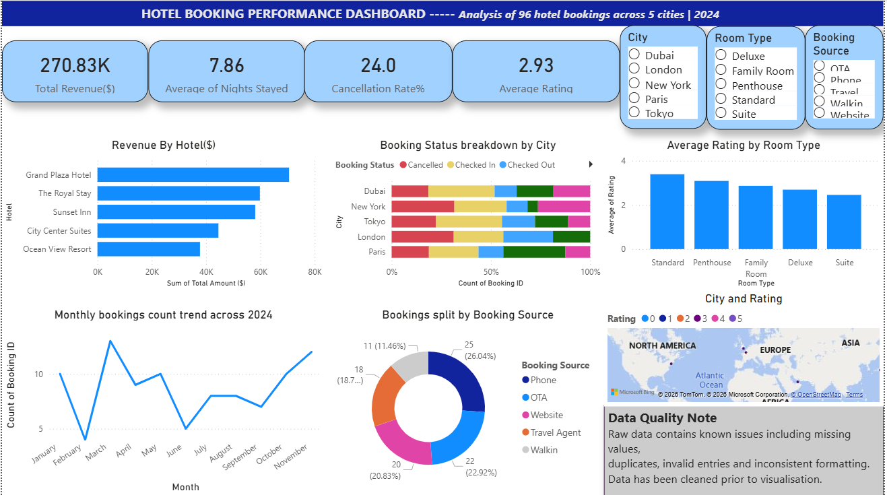

# 📊 Hotel Booking Performance Dashboard (Power BI)

## Dashboard Preview

## 📊 Project Overview

This project presents an interactive Power BI dashboard analyzing hotel booking performance across 5 cities.

The goal is to provide business insights into revenue, booking trends, customer behavior, and operational performance.

---

## 🛠 Tools Used

* Power BI

* Power Query

* DAX

---

## 📈 Key KPIs

* Total Revenue: $270.83K

* Average Nights Stayed: 7.86

* Cancellation Rate: 24%

* Average Rating: 2.93

---

## 📊 Dashboard Features

* Revenue by Hotel

* Booking Status Breakdown by City

* Monthly Booking Trends

* Booking Source Distribution

* Rating by Room Type

* Interactive Filters (City, Room Type, Booking Source)

---

## 🔍 Key Insights

* Revenue is concentrated in a few top-performing hotels.

* Cancellation rate (24%) is relatively high and may affect profitability.

* OTA and Website channels dominate bookings.

* Booking patterns show fluctuations across months, suggesting seasonality.

* Lower ratings in some room types may impact repeat bookings.

---

## 📸 Dashboard Preview

---

## 📂 Files Included

* Power BI dashboard file (.pbix)

* Dataset (.csv)

* Dashboard screenshot

---

## 🚀 Skills Demonstrated

* Data Modeling

* KPI Development (DAX)

* Interactive Dashboard Design

* Business Insight Generation

